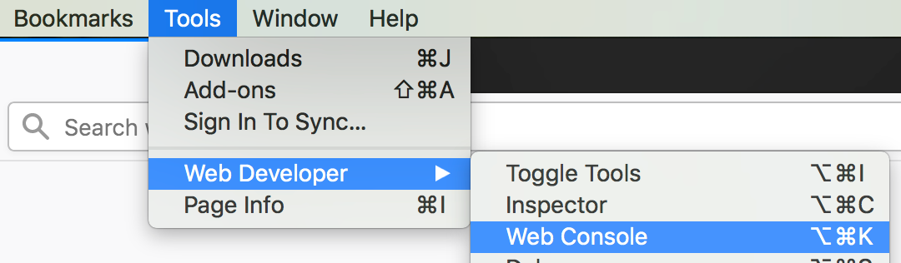
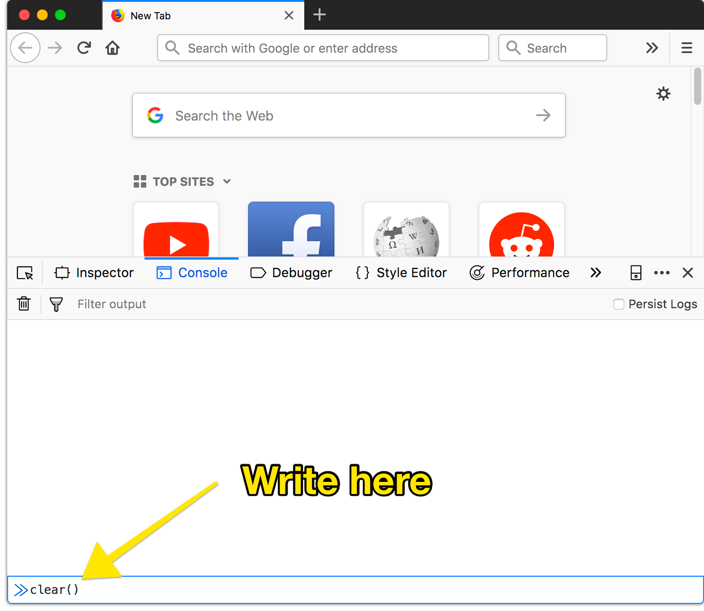

# Problem solving with JS

In everyone's everyday life, there things you can solve with code.
let's dive right into examples.

## Calculate taxes

Let's say you're looking for something at different online shops, and some give you prices that include taxes, and others you have to add, for example 6% of taxes.

## Analyze some data

If you ever worked with excel or anything equivalent, chances are you cam across fairly big amounts of data.

Maybe what you're looking at is the results of a survey, with 20 participants. The form contained checkboxes where participants indicate what languages they speak

```
[] English
[] Swedish
[] Arabic
```

Now when you look at the results as a Google Sheet, here's how 20 rows of results could look.

```
English,Swedish,Arabic
English
Swedish
English,Swedish,Arabic
English,Swedish,Arabic
English,Swedish
English,Swedish,Arabic
English,Swedish
Arabic
Swedish,Arabic
English,Swedish
English
English,Swedish
English,Swedish,Arabic
English,Swedish
English,Arabic
English,Swedish,Arabic
English,Swedish,Arabic
Swedish
English,Arabic
English,Swedish
```
Each participants list of languages becomes the text in one cell, the options they picked get smashed together, separated by a `,` comma. That's just how these survey results work.

## Interpreting data

Now how many of your participants actually speak English? Okay, that's still easy enough to count. If it's 500 participants, that gets really tedious though.

Or what if you want to know how many don't speak either English or Swedish?

## Code to the rescue

Once you know some basics, it's not hard to actually answer these and other questions quickly, with JavaScript.

You can do this in the browsers JavaScript console. In Firefox, you can find it in the Menu. `Tools > Web Developer > Web Console`.



When you open it, it's actually somewhat attached to the page you're on, but that doesn't matter for the sake of this exercise. If you however see a lot of strange text in the console, thatg belongs to the website you're on and I recommend getting rid of it.



What you do is write `clear()` and hit the enter key to run what you wrote.

Also, Firefox will try to protect us from people trying to trick their users into giving them access to data or do all other kinds of tricks, so we have to write `allow pasting` in that console and press enter as well.

### Get your data in

Select the rows you want to work with on the Google Sheets page and Copy to the clipboard. You can right click to find `Copy` or press the copy shortcut on your system which is highly worth learning (`CMD C` on Mac and `CTRL C` everywhere else).

Now you want that data in your console in some way, so you can work with it. Here's what you write:

```js
let data = ``
```

### Wait what?

What this does is, well, before you hit enter it does nothing, but don't do that just yet. What we're doing here is start to define a **variable** called `data`. The `let` command is one of the ways of doing that.

Think of a **variable** as a box. There isn't always something inside such a box, but with the `=` sign we say that that now want `data` to have a value. So far we have then written two strange looking characters. It's called **backtick** and looks like something that got lost on a word in french, maybe on an `é`, but think of it more like a quote, like this guy `"`.

Next, place your cursor between the backticks and paste your data (`CMD V` on Mac and `CTRL V` everywhere else).

If you hit enter now, you'll have defined a variable called `data` and the value is a long piece of text. You can check by typing `data` and hitting enter again. It should show you something that looks like your data.

### Text to list of texts

A piece of text in the context of programming is often called a **string**, and that's what's now in the variable `data` because you pasted it.

We'll skip over a few details here (and encourage you to ask questions in class), but what we actually need is a list of these little lists of languages instead.

### A lists of lists?

Yeah. First we want a list of the answers of each participants. So a list that starts with `English,Swedish,Arabic` as the first item, and then the next thing in the list would just be `English`.

We can produce a list from that long `data` by telling JavaScript how one value is separated from another. Now for example we could say this:
```js
data.split(",")
```
The console will show you the resulting list.

It starts like this `[ "English", "Swedish", ...`  – that's a list of languages, but as our participants could pick from sevaral options, we lost context of who answered with what.

### Split by participants

What sets one participant's answer apart from another, is actually that it's on the next line. There's a neat trick to split by line break, which if often called a "new line" or "newline". JavaScript's way of descrbing those is `\n`.

So now, try running this guys right here
```js
data.split("\n")
```

The result of that looks kind of like this:
```js
Array(21) [ "English,Swedish,Arabic", "English", "Swedish", "English,Swedish,Arabic", "English,Swedish,Arabic", "English,Swedish", "English,Swedish,Arabic", "English,Swedish", "Arabic", "Swedish,Arabic", … ]
```
That's a lot more like what we want.

### Arrays

A lists like the one we get by splitting here is called an **array** in JavaScript. You can see that the console tells you that the result of that split is one, and it also tells you the **length** of the Array, so how many items the list has (21).

### Now how many can speak English?

Disclaimer

What isn't very clean here is that we never use a keyword to declare our variables. We will learn about how to do that and why we should really do it a bit later, but the advantage we get from not doing it here is that we can run the same line of code as often as we want and it won't break because a variable is already declared.